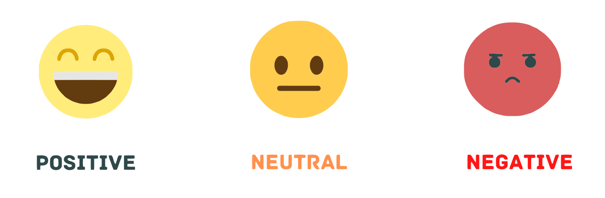
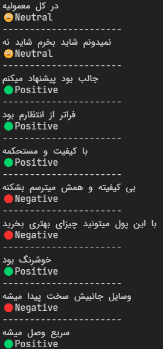

<h1>Comment Sentiment Analyzer</h1>
<h4>An exploration into the process of developing a comment analysis system using AI models.</h4>

<h4>The following models are being planned:</h4>

<ul>
<li>✅ MLP (77% accuracy)</li>
<li>CNN</li>
<li>LSTM</li>
<li>Transformer</li>
</ul>

<h3>How it works?</h3>
The trained model takes the input sentence and generates a sentiment prediction for it:
 
 

**Kharazmi University** - Winter 2024
